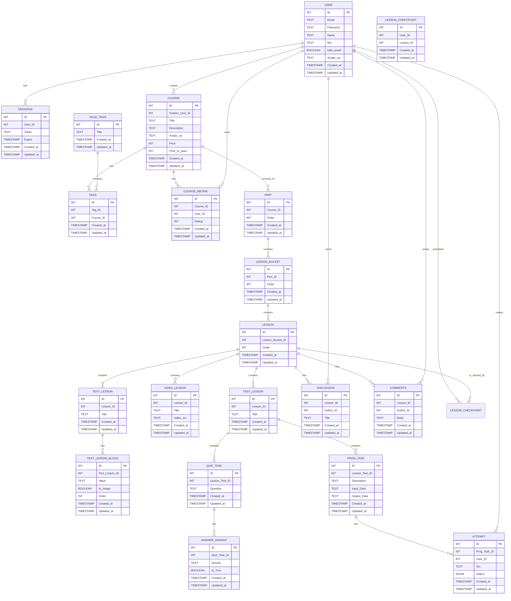

```mermaid

erDiagram
    USER {
        INT ID PK
        TEXT Email 
        TEXT Password 
        TEXT Name 
        TEXT Bio 
        BOOLEAN hide_email
        TEXT Avatar_src 
        TIMESTAMP Created_at
        TIMESTAMP Updated_at
    }

    SESSIONS {
        INT ID PK
        INT User_ID 
        TEXT Token 
        TIMESTAMP Expire
        TIMESTAMP Created_at
        TIMESTAMP Updated_at
    }

    COURSE {
        INT ID PK
        INT Creator_User_ID 
        TEXT Title 
        TEXT Description 
        TEXT Avatar_src 
        INT Price
        INT Time_to_pass 
        TIMESTAMP Created_at
        TIMESTAMP Updated_at
    }

    VALID_TAGS {
        INT ID PK
        TEXT Title 
        TIMESTAMP Created_at
        TIMESTAMP Updated_at
    }

    TAGS {
        INT ID PK
        INT Tag_ID
        INT Course_ID
        TIMESTAMP Created_at
        TIMESTAMP Updated_at
    }

    COURSE_METRIK {
        INT ID PK
        INT Course_ID 
        INT User_ID 
        INT Rating 
        TIMESTAMP Created_at
        TIMESTAMP Updated_at
    }

    PART {
        INT ID PK
        INT Course_ID 
        INT Order
        TIMESTAMP Created_at
        TIMESTAMP Updated_at
    }

    LESSON_BUCKET {
        INT ID PK
        INT Part_ID 
        INT Order
        TIMESTAMP Created_at
        TIMESTAMP Updated_at
    }

    LESSON {
        INT ID PK
        INT Lesson_Bucket_ID 
        INT Order
        TIMESTAMP Created_at
        TIMESTAMP Updated_at
    }

    TEXT_LESSON {
        INT ID PK
        INT Lesson_ID 
        TEXT Title 
        TIMESTAMP Created_at
        TIMESTAMP Updated_at
    }

    VIDEO_LESSON {
        INT ID PK
        INT Lesson_ID 
        TEXT Title 
        TEXT Video_src 
        TIMESTAMP Created_at
        TIMESTAMP Updated_at
    }

    TEST_LESSON {
        INT ID PK
        INT Lesson_ID 
        TEXT Title 
        TIMESTAMP Created_at
        TIMESTAMP Updated_at
    }

    TEXT_LESSON_BLOCK {
        INT ID PK
        INT Text_Lesson_ID 
        TEXT Value 
        BOOLEAN Is_Image
        INT Order
        TIMESTAMP Created_at
        TIMESTAMP Updated_at
    }

    DISCUSSION {
        INT ID PK
        INT Lesson_ID 
        INT Author_ID 
        TEXT Title 
        TIMESTAMP Created_at
        TIMESTAMP Updated_at
    }

    COMMENTS {
        INT ID PK
        INT Lesson_ID 
        INT Author_ID 
        TEXT Body 
        TIMESTAMP Created_at
        TIMESTAMP Updated_at
    }

    LESSON_CHEKCPOINT {
        INT ID PK
        INT User_ID 
        INT Lesson_ID
        TIMESTAMP Created_at
        TIMESTAMP Updated_at
    }

    QUIZ_TASK {
        INT ID PK
        INT Lesson_Test_ID 
        TEXT Question 
        TIMESTAMP Created_at
        TIMESTAMP Updated_at
    }

    ANSWER_VARIANT {
        INT ID PK
        INT Quiz_Task_ID 
        TEXT Answer 
        BOOLEAN Is_True
        TIMESTAMP Created_at
        TIMESTAMP Updated_at
    }

    PROG_TASK {
        INT ID PK
        INT Lesson_Test_ID 
        TEXT Description 
        TEXT Input_Data 
        TEXT Output_Data 
        TIMESTAMP Created_at
        TIMESTAMP Updated_at
    }

    ATTEMPT {
        INT ID PK
        INT Prog_Task_ID 
        INT User_ID 
        TEXT Src 
        ENUM Status
        TIMESTAMP Created_at
        TIMESTAMP Updated_at
    }

    USER ||--o{ SESSIONS : has
    USER ||--o{ COURSE : creates
    COURSE ||--o{ TAGS : has
    VALID_TAGS ||--o{ TAGS : contains
    COURSE ||--o{ COURSE_METRIK : has
    USER ||--o{ COURSE_METRIK : rates
    COURSE ||--o{ PART : consists_of
    PART ||--o{ LESSON_BUCKET : contains
    LESSON_BUCKET ||--o{ LESSON : contains
    LESSON ||--o{ TEXT_LESSON : contains
    LESSON ||--o{ VIDEO_LESSON : contains
    LESSON ||--o{ TEST_LESSON : contains
    TEXT_LESSON ||--o{ TEXT_LESSON_BLOCK : has
    LESSON ||--o{ DISCUSSION : has
    LESSON ||--o{ COMMENTS : has
    USER ||--o{ DISCUSSION : starts
    USER ||--o{ COMMENTS : writes
    USER ||--o{ LESSON_CHECKPOINT : completes
    LESSON ||--o{ LESSON_CHECKPOINT : is_tracked_by
    TEST_LESSON ||--o{ QUIZ_TASK : contains
    QUIZ_TASK ||--o{ ANSWER_VARIANT : has
    TEST_LESSON ||--o{ PROG_TASK : contains
    PROG_TASK ||--o{ ATTEMPT : has
    USER ||--o{ ATTEMPT : makes
```